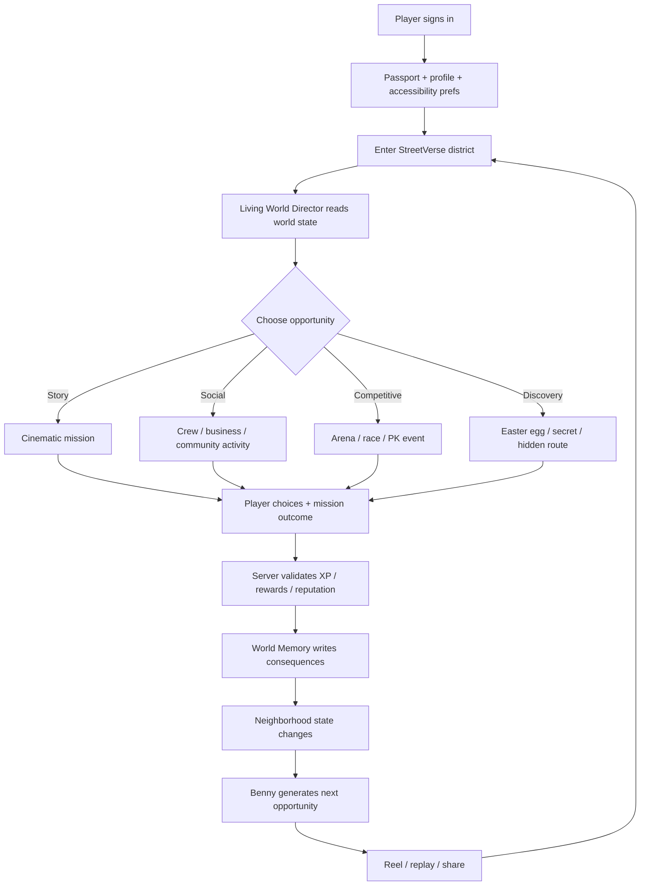
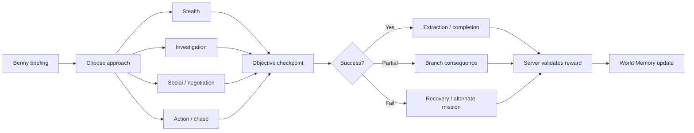
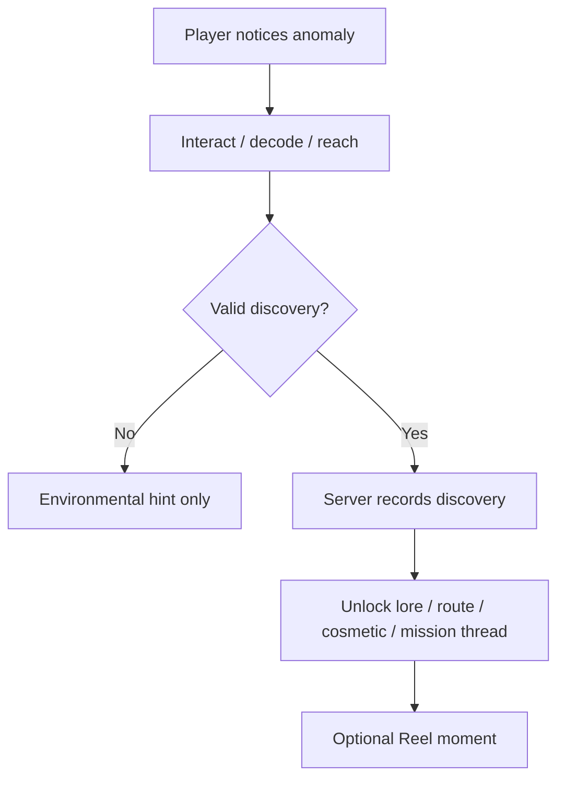

# StreetVerse Living World Director

This document turns the StreetVerse Living World Game Network concept into implementable gameplay logic, workflows, Easter eggs, and reusable system contracts. It is a design/engineering specification, not proof that the runtime is already production-complete.

## Core Promise
StreetVerse should feel like a playable city that remembers what the player does.

The runtime combines:
- Cinematic spy/investigation missions
- Shared open-world social play
- Competitive city events
- Creator/Reel capture
- Business and sponsored missions
- Persistent consequences and reputation
- Benny/Stubbs AI as the Story Director

## High-Level Logic Diagram



## Gameplay State Machine

```text
BOOT
  -> AUTHENTICATED
  -> PASSPORT_READY
  -> DISTRICT_ENTERED
  -> WORLD_SCAN
  -> OPPORTUNITY_OFFERED
  -> PLAYER_ACCEPTED
  -> ACTIVE_GAMEPLAY
  -> OBJECTIVE_RESOLVED
  -> SERVER_VALIDATION
  -> REWARD_GRANTED
  -> CONSEQUENCE_WRITTEN
  -> REPLAY_AVAILABLE
  -> RETURN_TO_WORLD
```

## Living World Director Logic

### Inputs
The director should evaluate:
- player level and unlocked systems
- current district/neighborhood
- recent mission history
- reputation per faction/neighborhood
- crew members nearby
- businesses/events currently active
- weather/time-of-day/game season
- unresolved narrative threads
- accessibility settings
- moderation/safety state
- sponsor/event inventory
- cooldowns so content does not repeat

### Opportunity scoring
Each candidate mission/event receives a score.

```ts
export type OpportunityType =
  | "story"
  | "social"
  | "business"
  | "competitive"
  | "discovery";

export interface WorldContext {
  playerId: string;
  districtId: string;
  level: number;
  reputation: Record<string, number>;
  crewIds: string[];
  unresolvedThreads: string[];
  recentOpportunityIds: string[];
  accessibility: {
    reducedMotion?: boolean;
    subtitles?: boolean;
    highContrast?: boolean;
    simplifiedControls?: boolean;
  };
}

export interface Opportunity {
  id: string;
  type: OpportunityType;
  districtId: string;
  minLevel: number;
  tags: string[];
  baseWeight: number;
  repeatPenalty?: number;
  requiredThreads?: string[];
}

export function scoreOpportunity(
  opportunity: Opportunity,
  ctx: WorldContext
): number {
  if (ctx.level < opportunity.minLevel) return -Infinity;
  if (opportunity.districtId !== ctx.districtId) return -Infinity;

  let score = opportunity.baseWeight;

  if (ctx.recentOpportunityIds.includes(opportunity.id)) {
    score -= opportunity.repeatPenalty ?? 50;
  }

  if (
    opportunity.requiredThreads?.some((thread) =>
      ctx.unresolvedThreads.includes(thread)
    )
  ) {
    score += 40;
  }

  if (opportunity.type === "social" && ctx.crewIds.length > 0) {
    score += 15;
  }

  if (opportunity.type === "discovery") {
    score += Math.random() * 10;
  }

  return score;
}
```

The server chooses from the highest-scoring safe/eligible opportunities rather than letting the client decide rewards.

## Mission Workflow



## World Memory

World Memory should store compact consequences, not excessive raw user data.

```ts
export interface WorldMemoryEvent {
  playerId: string;
  districtId: string;
  type:
    | "mission_completed"
    | "mission_failed"
    | "business_helped"
    | "faction_reputation"
    | "crew_event"
    | "easter_egg_found"
    | "district_changed";
  key: string;
  value: string | number | boolean;
  createdAt: string;
  expiresAt?: string;
}
```

Examples:
- player helped a restaurant -> owner recognizes them later
- player betrayed a faction -> future guard dialogue changes
- crew won a district event -> temporary banner appears in that district
- player found hidden transit tunnel -> alternate route unlocks
- neighborhood reputation crosses threshold -> new mission chain opens

## Neighborhood Reputation

Recommended reputation dimensions:
- community trust
- creator influence
- business support
- street racing reputation
- investigator/agent reputation
- crew loyalty

Use thresholds instead of endless numbers:

```text
-100 to -51 = Hostile
-50 to -11  = Distrusted
-10 to 10   = Unknown
11 to 50    = Known
51 to 80    = Trusted
81 to 100   = Legendary
```

## Crews / Families

Crew system should support:
- shared missions
- crew reputation
- co-op objectives
- crew safehouse/hub
- seasonal crew challenges
- creator collaboration
- business sponsorships
- rivalry events

Keep rivalry competitive rather than harassment-oriented; moderation rules should apply to names, chat, and targeting.

## World Seasons

Each season can change:
- district visuals
- NPC schedules
- temporary events
- mission chains
- race routes
- business promotions
- collectibles
- mystery threads
- world boss/challenge finales

Player history should persist across seasons even if temporary scenery/events rotate.

## Easter Egg System

Easter eggs should reward exploration, lore, creativity, and replay rather than only handing out currency.

### Categories
1. **Chicago lore eggs** — architecture, music, transit, neighborhood history references.
2. **Spy eggs** — coded payphones, hidden briefcases, elevator access codes, fake storefronts.
3. **Creator eggs** — secret camera angles, studio rooms, rare Reel filters, hidden stages.
4. **Business eggs** — hidden menu item, founder badge, secret merchant quest.
5. **Traversal eggs** — rooftops, tunnels, alleys, train platforms, boat routes.
6. **Seasonal eggs** — appear only during certain world events.
7. **Crew eggs** — require 2-4 players doing synchronized actions.
8. **Benny mystery eggs** — fragments that unlock deeper Story Director lore.

### Discovery flow



### Example Easter eggs
- Three inactive public phones ring in a specific order and reveal a hidden spy mission.
- A rooftop mural changes at midnight and points to a secret parkour route.
- A restaurant receipt contains coordinates for a business-passport quest.
- Completing one peaceful negotiation, one race, and one creator challenge in the same district unlocks a Benny mystery fragment.
- A concealed train platform opens only for crews whose combined district reputation exceeds a threshold.
- A hidden arcade cabinet launches a retro mini-game and awards a non-pay-to-win collectible.

## Competitive / Arena Workflow

```text
JOIN EVENT
 -> LOADOUT / VEHICLE / MOVEMENT CHOICE
 -> READY CHECK
 -> OBJECTIVE PHASE 1
 -> ROTATING WORLD MODIFIER
 -> OBJECTIVE PHASE 2
 -> FINALE
 -> SCORE VALIDATION
 -> REWARD + REPUTATION
 -> HIGHLIGHT REEL
 -> RETURN TO DISTRICT
```

Competitive events can include:
- parkour relay
- street race
- capture/hold objective
- delivery sprint
- clue race
- creator challenge
- crew-vs-crew non-lethal objective event
- sponsored city challenge

## Server-Authoritative Reward Contract

```ts
export interface RewardRequest {
  playerId: string;
  activityId: string;
  activityType: "mission" | "event" | "discovery";
  completionToken: string;
}

export interface RewardResult {
  accepted: boolean;
  xp: number;
  softCurrency: number;
  reputationChanges: Record<string, number>;
  unlocks: string[];
}

export async function grantReward(
  request: RewardRequest
): Promise<RewardResult> {
  const completion = await validateCompletionToken(request.completionToken);

  if (!completion.valid || completion.playerId !== request.playerId) {
    return {
      accepted: false,
      xp: 0,
      softCurrency: 0,
      reputationChanges: {},
      unlocks: [],
    };
  }

  const reward = calculateServerReward(completion);
  await writeLedgerEntry(request.playerId, reward);
  await applyReputation(request.playerId, reward.reputationChanges);

  return { accepted: true, ...reward };
}
```

The client displays rewards but does not mint them.

## Reel / Highlight Integration

Every activity can emit highlight markers:

```ts
export interface HighlightMarker {
  activityId: string;
  timestampMs: number;
  category:
    | "objective"
    | "chase"
    | "discovery"
    | "crew"
    | "stunt"
    | "dialogue"
    | "victory";
  priority: number;
}
```

After the mission/event, Reel Composer can automatically suggest the top moments while the player retains control over what gets shared.

## Recommended Additional Systems

### 1. Consequence Graph
Represent story consequences as a graph so future missions can react to previous choices without hand-writing every combination.

### 2. District Simulation Budget
Do not simulate all 77 neighborhoods at full fidelity simultaneously. Run nearby areas in high detail, important remote events at medium detail, and dormant areas as compact state updates. This preserves performance.

### 3. Dynamic Difficulty Director
Adjust encounter complexity, navigation help, enemy/NPC awareness, and objective timing without changing reward integrity.

### 4. Accessibility Director
Respect reduced motion, simplified controls, subtitle preferences, contrast, controller remapping, and alternative timing windows at mission generation time.

### 5. Anti-Repetition Memory
Track recently seen mission templates, dialogue patterns, and locations so generated content does not feel repetitive.

### 6. Discovery Journal
Give players a visual journal containing secrets, lore fragments, unexplained clues, discovered businesses, and unresolved mysteries.

### 7. District Heat / Calm State
World activities affect short-lived district states such as celebration, high traffic, event lockdown, festival, rainstorm, or investigation. This creates visible consequence without permanently breaking the map.

### 8. Ethical Sponsor Layer
Sponsored missions should be clearly labeled, age-appropriate, optional, and should never secretly manipulate mission outcomes or progression.

## First Vertical Slice

Build and certify one experience before expanding the entire city:

```text
SIGN IN
 -> PASSPORT
 -> ENTER CHICAGO DISTRICT
 -> BENNY BRIEFING
 -> CHOOSE APPROACH
 -> INVESTIGATE / CHASE / NEGOTIATE
 -> EXTRACTION
 -> SERVER REWARD
 -> REPUTATION CHANGE
 -> WORLD MEMORY
 -> REEL HIGHLIGHT
 -> NEXT BENNY OPPORTUNITY
```

## What This Architecture Does

It turns StreetVerse from a collection of features into a coherent replayable system. The same core director can continuously combine missions, businesses, crews, competitions, discoveries, reputation, and creator moments while preserving player history. That gives the platform a stronger identity: a persistent city that reacts to players instead of a static map with disconnected activities.
